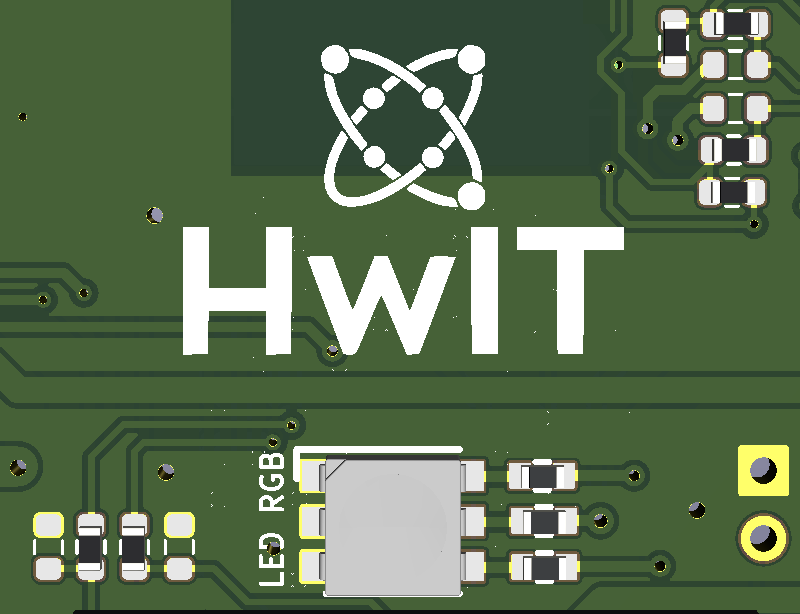
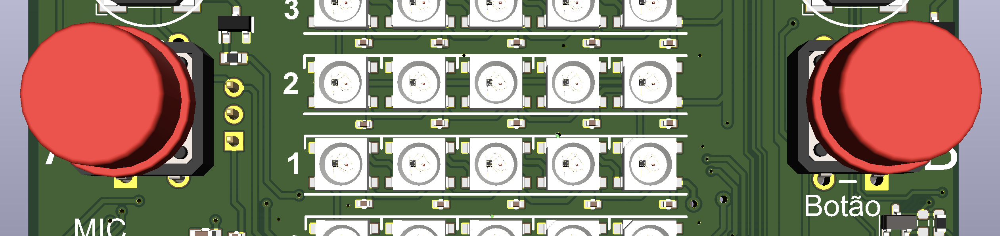
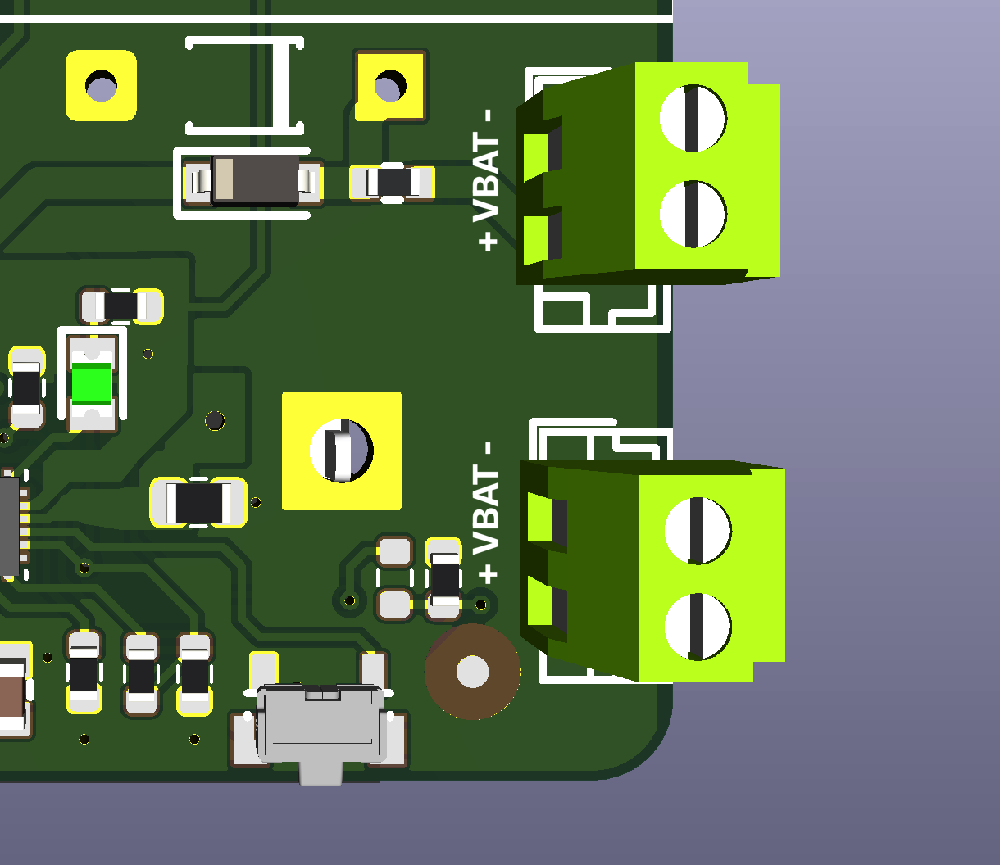
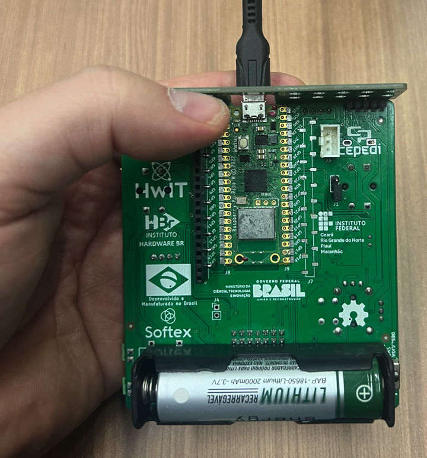

# Iniciando com Micropython

**Table of Contents**

- [[PT-BR] Manual BitDogLab (Iniciando com Micropython)](#iniciando-com-micropython))

	- [Conteúdo material](#conte%C3%BAdo-material)

	- [Abrindo a BitDogLab](#montando-a-bitdoglab)

	- [Especificação/Periféricos da BitDogLab v6.4](#especifica%C3%A7%C3%A3operif%C3%A9ricos-da-bitdoglab-v53)

	- [Programando a BitDogLab](#programando-a-BitDogLab)

		- [Gravação do firmware](#grava%C3%A7%C3%A3o-do-firmware)

			- [Alternativas de gravação de firmware](#alternativas-de-grava%C3%A7%C3%A3o-de-firmware)

	- [Executando primeiro exemplo de código](#executando-primeiro-exemplo-de-c%C3%B3digo)


A **BitDogLab versão Embarcatech**, é uma iniciativa que utiliza o hardware aberto iniciado no projeto escola 4.0 na Unicamp, que se trata de uma ferramenta educacional voltada para o aprendizado de computação embarcada e eletrônica. Baseada no dispositivo Raspberry Pi Pico W (wifi/bluetooth), a BitDogLab permite ao usuário explorar, montar e programar usando componentes montados nesta placa além de componentes adicionais externos (periféricos) conectados em uma forma organizada e estruturada. Meticulosamente selecionados, os componentes fomentam o aprendizado com "mãos na massa", encorajando os usuários a evoluírem suas habilidades em programação embarcada e eletrônica de forma progressiva e sinérgica. Adicionalmente a BitDogLab pode ser otimizada para programação avançada por meio do uso dos [periféricos básicos e avançados](../../hardware/), assim como pode integrar inteligência artificial e/ou aprendizado de máquina de borda por meio do [tinyML](https://github.com/raspberrypi/pico-tflmicro).

No caso do programa embarcatech oriundos do [Ministério da Ciência e Tecnologia do Brasil - MCTI](https://www.gov.br/mcti/pt-br) e executado pela [Softex](https://softex.br/), o objetivo é adaptar a ferramenta bitdoglab para uso no programa de treinamento em sistemas embarcados [Embarcatech](https://embarcatech.softex.br/), objetivando o desenvolvimento de alunos universitários por meio do programa de residência tecnológica em sistemas embarcados, buscando catalizar e incorporar essa capacitação tão necessária para estudantes de engenharia e computação nos dias de hoje.

## Conteúdo material

A bitdoglab vem uma caixa padrão de correio (16x11x5 cm) como a ilustrada abaixo.


Dentro da caixa você encontra a BitDogLab envolta em um envelope anti-estático e um cabo tipo micro-usb para usb-a.


Cabo tipo micro-usb para usb-a


## Abrindo a BitDogLab

Retire a placa do envelope anti-estático.


Retire o plastico bolha anti-estático e dessa forma a BitDogLab estará pronta para uso.


## Especificação/Periféricos Embarcados da BitDogLab v6.4

A placa BitDogLab possui as seguintes dimensões: 99 x 89 x 25 mm (comprimento, largura e altura).


A Placa BitDogLab é uma plataforma completa indicada para ensino de software/sistemas embarcados.
O módulo Microcontrolador é o cérebro da placa, composto pelo microcontrolador [Raspberry Pi Pico W](https://www.raspberrypi.com/documentation/microcontrollers/raspberry-pi-pico.html "Raspberry Pi Pico W") com as seguintes especificações:
- Microcontrolador RP2040 microcontroller
- Módulo castelado para soldagem direta na placa base BitDogLab
- Processador Dual-core Arm Cortex-M0+, clock flexivel até 133 MHz
- 264kB SRAM e 2MB QSPI flash embarcado
- Rede sem fio do tipo LAN 2.4GHz 802.11n
- Bluetooth 5.2
- 26 pinos multifuncionais (GPIO), incluindo 3 pinos analógicos
- Controladores: 2 × UART, 2 × SPI, 2 × I2C e 16 canais PWM 
- Controlador USB 1.1 com PHY, suportando modos host e device
- 8x I/Os programáveis (PIO) por meio de máquinas de estado para periféricos customizados
- Tensão de entrada de 1.8–5.5V DC
- Temperatura de operação de -20°C to +70°C
- Programação do tipo Drag-and-drop usando mass storage USB
- Modo de operação de baixo consumo e dormente
- Clock preciso e sensor de temperatura embarcado
- Bibliotecas de aceleração de cálculos inteiros e de ponto flutuante no chip

Pinout Raspberry Pi Pico W


Lista de periféricos embarcados na placa BitDogLab:

1) A BitDogLab possui uma Bateria 3.7V 2200Mah Li-Ion CR18650 e seu devido suporte de bateria.


2) LED Colorido (SMD5050 RGB LEDs ROHS)



3) Display OLED (0.96 polegadas I2C 128x64 oled display)


4) Matriz de LEDs coloridos (LED-RGB 5x5 5050 WS2812)


5) Microfone com amplificador de áudio (MAX4466EXK)


6) Joystick Analógico (Plugin 13x13mm Multi-Dir ROHS)


7) Botões (A e B) - Chave Táctil 12x12x7.5 mm



8) Buzzers (Esquerdo e Direito) - 80dB Externally Driven Magnetic 2.7kHz SMD, 8.5x8.5mm Buzzers ROHS


9) Conectores de sensores de expansão I2C (1 e 0) - 2.5mm Plugin,P=2.5mm Wire To Board Connector ROHS
- I2C1 (pino 1 – esquerda)
	- 1: GP3 (SCL I2C1)
	- 2: GP2 (SDA I2C1)
	- 3: 3.3V
	- 4: GND referencia
- I2C0 (pino 1 – esquerda)
	- 1: GP1 (SCL I2C0)
	- 2: GP0 (SDA I2C0)
	- 3: 3.3V
	- 4: GND referencia


1)  Circuito de gerenciamento de energia - [BQ25622 da texas instruments](https://www.ti.com/product/BQ25622), carregador de bateria de célula simples com até 18V de tensão máxima de entrada, limitador de corrente, conversor analógico digital (ADC) embarcado para monitoração de parâmetros de carregamento e descarregamento de baterias, e função on-the-go (OTG ou seja, é capaz de fornecer alimentação para algum dispositivo conectado no seu barramento USB), controlado por barramento i2c.


11) Conector de expansão de GPIOs (pino 1 canto superior direito) - 2.54mm Straight Gold Brass 2x7P 7 Push - Pull P=2.54mm IDC Connectors ROHS
- 1: GND referencia
- 2: VSYS (5V)
- 3: 3.3V
- 4: GP8
- 5: GP28
- 6: GP9
- 7: AGND ou GP15 (depende da configuração de jumpers no esquemático)
- 8: GP4
- 9: GP17
- 10: GP20
- 11: GP16
- 12: GP19
- 13: GND referência/GP14 (depende da configuração de jumpers no esquemático)
- 14: GP18


12) Botão de reset - 8mm Round Button Brick nogging SPST SMD Tactile Switches ROHS


13) Conector para painel solar (6V) - 1x2P -40℃~+105℃ 8A 130V Green 18~26 Straight 2.54mm 0.5~1 1 2 Plugin,P=2.54mm Screw terminal ROHS



14) Conector para bateria externa - 1x2P -40℃~+105℃ 8A 130V Green 18~26 Straight 2.54mm 0.5~1 1 2 Plugin,P=2.54mm Screw terminal ROHS

15) Chave liga-desliga do lado direito da bateria (chave deslizante deslocada no sentido de + ou seja para baixo liga, e no sentido inverso ou seja para cima desliga)


1)  Pinos e expansão para painel compatível com garras jacaré ou parafusos (1x5 header esquerdo e direito, cor preta)
- 1x5 header esquerdo J5 (pino 5 na esquerda, pino 1 na direita):
	- 5: AGND
	- 4: GP28 (se solder jumper JP1 ativo)
	- 3: GND referencia
	- 2: 3.3V
	- 1: VSYS (5V)
- 1x5 header direito J12 (pino 5 na esquerda, pino 1 na direita):
	- 5: GND
	- 4: GP0
	- 3: GP1
	- 2: GP2
	- 1: GP3


O painel frontal acima embarca um conectore 1x6 header em configuração compatível com módulo bluetooth [HC-05](https://www.makerhero.com/blog/tutorial-arduino-bluetooth-hc-05-mestre/) (módulo que possui uma maior facilidade de uso devido a exemplos disponíveis na comunidade)


1)  Jumper de seleção de conversor analógico digital (pino ANA-IN no painel jacaré ou microfone), pino 1 indicado com marcação J1


## Programando BitDogLab

Para programar a Raspberry Pi Pico ou Pico W, precisamos realizar duas configurações iniciais, que são a configuração da Thonny IDE e a gravação do firmware para a linguagem Python.

O primeiro passo para a programação da placa é a instalação da Thonny IDE, que é o ambiente onde desenvolvemos e pelo qual gravamos o código na placa. Para isso, acesse a página de download da IDE abaixo.
https://thonny.org/

Em seguida então escolha a opção certa para o seu sistema operacional, como mostrado abaixo quando você posicionar o mouse no sistema operacional desejado.
Windows:


Mac:


Linux:


Com o arquivo baixado (em computadores Windows ou macOS), instale a Thonny IDE seguindo os passos do instalador. Em computadores Linux a instalação será feita automaticamente com o envio do comando no terminal. Assim que a instalação da IDE for concluída, abra-a.

A configuração que precisa ser feita na Thonny IDE para a programação da Raspberry Pi Pico é alterar o interpretador que será usado para a execução do código. Para isso, acesse as configurações da IDE, seguindo o caminho a seguir (Tools > Options).


Ao selecionar essa opção, será aberta uma janela com as configurações da IDE, como a da imagem a seguir. Não é necessária nenhuma configuração na seção "geral" ("General"), portanto apenas acesse a seção "Interpreter", como demarcado na imagem, e selecione o tipo de interpretador desejado, no nosso caso o **MicroPython (Raspberry Pi Pico)**.


### Gravação do firmware

Com essa configuração finalizada, está na hora de gravar o firmware do interpretador MicroPython na placa. Para isso, pressione o botão "BOOTSEL" da sua Raspberry Pi Pico, enquanto ela ainda está desconectada. Então conecte-a ao seu computador usando o cabo Micro USB, mantendo o botão pressionado. Depois que o cabo for completamente inserido no conector da placa, você já pode soltar o botão, como no GIF a seguir.

:warning: Uma alternativa para evitar plugar e desplugar o cabo usb várias vezes é apenas deixar o cabo sempre plugado, e segurar o BOOTSEL primeiro, apertar o botão de reset por 1 segundo e após soltar o botão de reset, soltar em seguida o BOOTSEL.





Esse procedimento faz com que a placa entre em modo de gravação de firmware e seja reconhecida como um disco removível. Inclusive você também poderá vê-la no diretório de discos do seu computador, como nesta imagem.


Neste momento, realize o drag and drop direto (ou ctrl+c e ctrl+v) do arquivo de firmware baixado no disco montado RPI-RP2 no seu computador.

**Firmware BitDogLab, compilado já com as bibliotecas embarcadas:**
 * [Firmware Raspberry Pi Pico](./releases/): gravar o arquivo hwit-pico-x.x.x-firmware.uf2 (exemplo: hwit-pico-0.0.1-firmware.uf2)
 * [Firmware Raspberry Pi Pico W](./releases/): gravar o arquivo hwit-picow-x.x.x-firmware.uf2 (exemplo: hwit-picow-0.0.1-firmware.uf2)

Assim que a gravação estiver finalizada, você pode fechar essa janela de gravação e fechar a janela de configuração da Thonny IDE. Para que a placa saia do modo de gravação de firmware, é necessário desconectar e reconectar a placa, porém, desta vez, sem pressionar o botão "BOOTSEL".

Agora a sua Raspberry Pi Pico já está pronta para receber códigos Python!

## Executando primeiro exemplo de código

Com a configuração finalizada e com a gravação de firmware concluída, digite o código a seguir na Thonny IDE (Acendendo o Led embarcado na Raspberry Pi Pico ou Pico W).

```python
import machine #biblioteca de controle do microcontrolador (machine)
import time #biblioteca de controle dos recursos de temporização

led = machine.Pin('LED', machine.Pin.OUT) #configura o pino LED como um pino de saida e cria um objeto 'led' da classe Pin (Pino)

while True: #enquanto for True for verdadeiro, ou seja, para sempre, faça...
  led.value(True)  #Liga o LED
  time.sleep(1)   #espera 1 segundo
  led.value(False)  #desliga o LED
  time.sleep(1)   #espera por 1 segundo
```

O código inicia com as adições da instância "Pin" da biblioteca "machine" do interpretador MicroPython e da função "sleep" da biblioteca "time" da própria linguagem Python. Feito isso, é criado o objeto led como uma saída do sistema conectada ao 'LED' da placa (esse objeto evita que você tenha que diferenciar o GPIO entre as placas Pi Pico e Pi Pico W), graças ao comando led = Pin('LED', Pin.OUT).

Já na repetição do código (função while True), apenas acendemos (led.value(True)) e apagamos (led.value(False)) o LED, com uma interrupção de 1 segundo (time.sleep(1)) a cada mudança de estado (de "high" para "low", e vice versa).

Após digitar o código na Thonny IDE, pressione o botão "Run", demarcado em amarelo na imagem abaixo, para executar o código.


Após selecionar essa opção, será aberta uma segunda janela requisitando o nome do arquivo, como na imagem a seguir (main.py).


Neste momento, digite um nome para o arquivo com a extensão ".py" (como feito na imagem acima), e então pressione o botão "OK". Assim que o arquivo for salvo na placa, ela já começará a executá-lo, piscando o LED de 1 em 1 segundo, como no vídeo a seguir.


