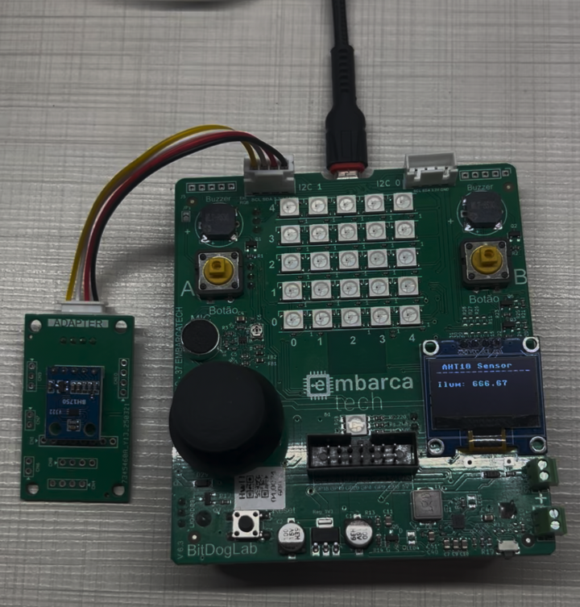
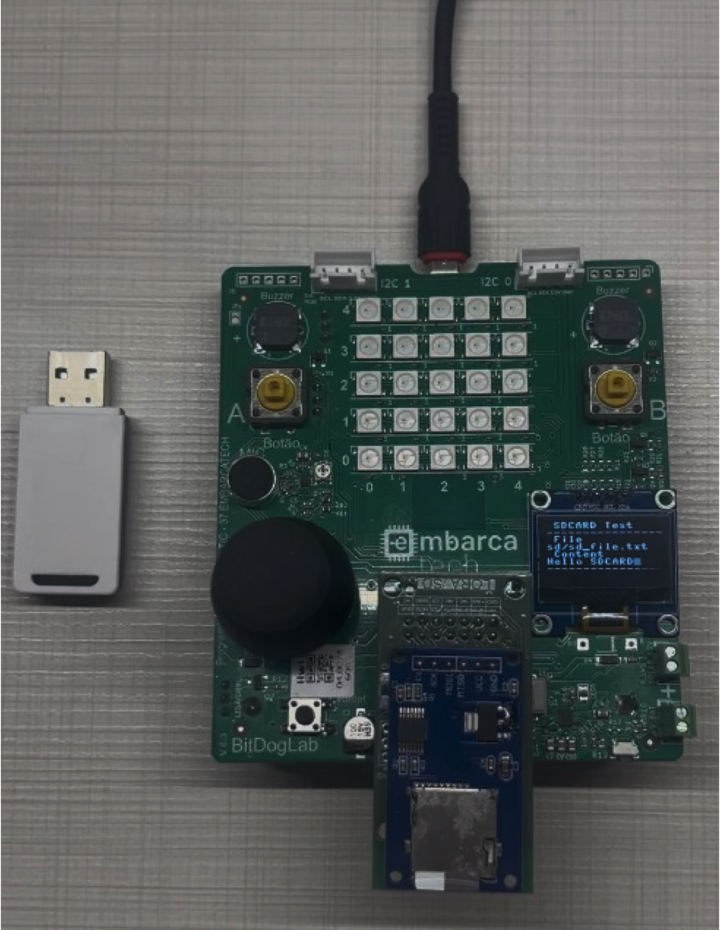
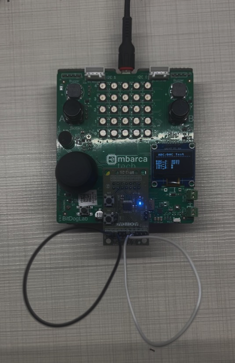

# Exemplos Micropython Periféricos

:warning: Antes de executar qualquer firmware micropython desse repositório, [siga o guia deste link](../README.md).

Essa pasta apresenta detalhes sobre todos os exemplos em micropython desenvolvidos para os periféricos da segunda fase do programa [Embarcatech](https://embarcatech.softex.br/), Os examplos para cada periférico são listados abaixo:

* Kit Básico de Periféricos (12 itens)
  * Periferico adaptador de sensores/atuadores
      * [[Sensor i2c] Acelerômetro](#sensor-aceler%C3%B4metro-i2c)
      * [[Sensor i2c] Oxímetro e batimentos cardiácos](#sensor-ox%C3%ADmetro-e-batimentos-card%C3%ADacos-i2c)
      * [[Sensor i2c] Medição de distância a Laser](#sensor-medi%C3%A7%C3%A3o-de-dist%C3%A2ncia-a-laser-i2c)
      * [[Sensor i2c] Temperatura e pressão](#sensor-temperatura-e-press%C3%A3o-i2c)
      * [[Sensor i2c] Luminosidade](#sensor-luminosidade-i2c)
      * [[Sensor i2c] Umidade e temperatura](#sensor-umidade-e-temperatura-i2c)
      * [[Sensor i2c] Cor RGB](#sensor-cor-rgb-i2c)
      * [[Atuador PWM] Servo Motor](#atuador-servo-motor-pwm)
  * [Periférico HDMI-DVI](#perif%C3%A9rico-hdmi)
  * [Periférico de extensão de conexões para sensores (i2c)](#perif%C3%A9rico-de-extens%C3%A3o-de-conex%C3%B5es-para-sensores-i2c)
  * [Periférico teclado matricial (GPIO)](#perif%C3%A9rico-teclado-matricial-gpio)
  * [Periférico de armazenamento de dados SDCARD (SPI)](#perif%C3%A9rico-de-armazenamento-de-dados-sdcard-spi)

* Kit Avançado de Periféricos (19 itens) = Kit Básico (12) + itens abaixo (7)
  * [Periferico conversor analógico digital ADC / digital analógico DAC / GPIO com oito portas (SPI)](#periferico-adc--dac--gpio-com-oito-portas-spi)
  * [Periférico câmera de 2M Pixels (interface paralela)](#perif%C3%A9rico-c%C3%A2mera-de-2m-pixels-interface-paralela)
  * [Periférico display LCD 320x240 pixels (SPI)](#perif%C3%A9rico-display-lcd-320x240-pixels-spi)
  * [Periférico comunicação radio de longa distância LoRA (SPI)](#perif%C3%A9rico-comunica%C3%A7%C3%A3o-radio-de-longa-dist%C3%A2ncia-lora-spi)
  * [Periférico GPS (UART)](#perif%C3%A9rico-gps-uart)
  * [Periférico Pi Pico debug probe (SWD)](#perif%C3%A9rico-pi-pico-debug-probe-swd)
  * [Periférico de extensão de conexões (SPI)](#perif%C3%A9rico-de-extens%C3%A3o-de-conex%C3%B5es-spi)

* Gerenciador de bateria bq25622 (i2c, embarcado na placa principal)

## Sensor: Acelerômetro (i2c)

O exemplo do acelerômetro se encontra [no seguinte arquivo código micropython](./1_acelerometro/mpu-demo.py), lembrando-se que é necessário antes ter realizado o carregamento do firmware com todas as bibliotecas necessárias mencionadas no guia deste [link](../README.md).

Detalhes sobre o hardware do periférico podem ser encontrados no seguinte [link](../../../hardware/peripherals_hw/README.md).

Figura 1: Setup de teste do acelerômetro MPU6500.

## Sensor: Oxímetro e batimentos cardíacos (i2c)

O exemplo do oxímetro e batimentos cardíacos se encontra [no seguinte arquivo código micropython](./2_oximetro_batimento_cardiaco/max30100-demo.py), lembrando-se que é necessário antes ter realizado o carregamento do firmware com todas as bibliotecas necessárias mencionadas no guia deste [link](../README.md).

Detalhes sobre o hardware do periférico podem ser encontrados no seguinte [link](../../../hardware/peripherals_hw/README.md).

Figura 2: Setup de teste do MAX30100.

## Sensor: Medição de distância a Laser (i2c)

O exemplo de medição de distância a Laser se encontra [no seguinte arquivo código micropython](./3_distancia_laser/vl53l0x.py), lembrando-se que é necessário antes ter realizado o carregamento do firmware com todas as bibliotecas necessárias mencionadas no guia deste [link](../README.md).

Detalhes sobre o hardware do periférico podem ser encontrados no seguinte [link](../../../hardware/peripherals_hw/README.md).

Figura 3: Setup de teste do VL53L0X.

## Sensor: Temperatura e pressão (i2c)

O exemplo de medição de temperatura e pressão se encontra [no seguinte arquivo código micropython](./4_temperatura_pressao/bmp280-demo.py), lembrando-se que é necessário antes ter realizado o carregamento do firmware com todas as bibliotecas necessárias mencionadas no guia deste [link](../README.md).

Detalhes sobre o hardware do periférico podem ser encontrados no seguinte [link](../../../hardware/peripherals_hw/README.md).

Figura 4: Setup de teste do BMP280.

## Sensor: Luminosidade (i2c)

O exemplo de medição de luminosidade se encontra [no seguinte arquivo código micropython](./5_luminosidade/bh1750-demo.py), lembrando-se que é necessário antes ter realizado o carregamento do firmware com todas as bibliotecas necessárias mencionadas no guia deste [link](../README.md).

Detalhes sobre o hardware do periférico podem ser encontrados no seguinte [link](../../../hardware/peripherals_hw/README.md).

Figura 5: Setup de teste do BH1750.

## Sensor: Umidade e temperatura (i2c)

O exemplo de medição de temperatura e umidade se encontra [no seguinte arquivo código micropython](./6_umidade_temperatura/aht10-demo.py), lembrando-se que é necessário antes ter realizado o carregamento do firmware com todas as bibliotecas necessárias mencionadas no guia deste [link](../README.md).

Detalhes sobre o hardware do periférico podem ser encontrados no seguinte [link](../../../hardware/peripherals_hw/README.md).

Figura 6: Setup de teste do AHT10.

## Sensor: Cor RGB (i2c)

O exemplo de sensoriamento de COR se encontra [no seguinte arquivo código micropython](./7_cor_rgb/tcs34725-demo.py), lembrando-se que é necessário antes ter realizado o carregamento do firmware com todas as bibliotecas necessárias mencionadas no guia deste [link](../README.md).

Detalhes sobre o hardware do periférico podem ser encontrados no seguinte [link](../../../hardware/peripherals_hw/README.md).

Figura 7: Setup de teste do TCS34725.

## Atuador: Servo Motor (PWM)

O exemplo de controle de um servo motor se encontra [no seguinte arquivo código micropython](./8_servo_motor/servo-sg90-demo.py), lembrando-se que é necessário antes ter realizado o carregamento do firmware com todas as bibliotecas necessárias mencionadas no guia deste [link](../README.md).

Detalhes sobre o hardware do periférico podem ser encontrados no seguinte [link](../../../hardware/peripherals_hw/README.md).

Figura 8: Setup de teste do Servo SG90.

## Periférico: HDMI-DVI

O periférico HDMI só possui exemplo em [**c/c++**](https://github.com/jrfo-hwit/hlab/tree/main/firmware/c_cpp/examples) devido exigência de performance da aplicação.

## Periférico de extensão de conexões para sensores (i2c)

O exemplo de controle de vários sensores utilizando o extensor de conexões para dispositivos i2c se encontra [no seguinte arquivo código micropython](./10_extensor_i2c_sensores_paralelo/parallel-sensor-test.py), lembrando-se que é necessário antes ter realizado o carregamento do firmware com todas as bibliotecas necessárias mencionadas no guia deste [link](../README.md).

Detalhes sobre o hardware do periférico podem ser encontrados no seguinte [link](../../../hardware/peripherals_hw/README.md).

Figura 9: Setup de teste da placa periferica de extensão de dispositivos I²C com 4 sensores conectados.

## Periférico teclado matricial (GPIO)

O exemplo de uso do periférico teclado matricial se encontra [no seguinte arquivo código micropython](./11_teclado_matricial/keypad-demo.py), lembrando-se que é necessário antes ter realizado o carregamento do firmware com todas as bibliotecas necessárias mencionadas no guia deste [link](../README.md).

Detalhes sobre o hardware do periférico podem ser encontrados no seguinte [link](../../../hardware/peripherals_hw/README.md).

Figura 10: Setup de teste da placa de interface com o teclado.

## Periférico de armazenamento de dados SDCARD (SPI)

O exemplo de uso do periférico SDCARD se encontra [no seguinte arquivo código micropython](./12_armazenamento_sdcard/sdcard-test.py), lembrando-se que é necessário antes ter realizado o carregamento do firmware com todas as bibliotecas necessárias mencionadas no guia deste [link](../README.md).

Detalhes sobre o hardware do periférico podem ser encontrados no seguinte [link](../../../hardware/peripherals_hw/README.md).

Figura 11: Setup de teste da placa periférica do SDCARD.

## Periferico ADC / DAC / GPIO com oito portas (SPI)

O exemplo de uso do periférico ADC/DAC/GPIO se encontra [no seguinte arquivo código micropython](./13_adc_dac_gpio/ad5592r-demo.py), lembrando-se que é necessário antes ter realizado o carregamento do firmware com todas as bibliotecas necessárias mencionadas no guia deste [link](../README.md).

Detalhes sobre o hardware do periférico podem ser encontrados no seguinte [link](../../../hardware/peripherals_hw/README.md).

Figura 12: Setup de teste da placa periférica do AD5592R.

## Periférico câmera de 2M Pixels (interface paralela)

O exemplo de uso do periférico CAMERA de 2M Pixels se encontra [no seguinte arquivo código micropython](./14_camera_2mp/cpy_Pico_ov2640_displayio_pico_st7789_2in.py), lembrando-se que é necessário antes ter realizado o carregamento do firmware [CIRCUIT PYTHON](../releases/adafruit-circuitpython-raspberry_pi_pico_w-en_US-9.2.7.uf2) e as respectivas bibliotecas mpy [adafruit_ov2640 para a camera](./14_camera_2mp/adafruit_ov2640.mpy) e [adafruit_st7789 para o lcd](./14_camera_2mp/adafruit_st7789.mpy) na bitdoglab on será realizado o teste.

Detalhes sobre o hardware dos periféricos envolvidos neste teste podem ser encontrados no seguinte [link](../../../hardware/peripherals_hw/README.md).

Figura 13: Setup de teste da camera.

## Periférico display LCD 320x240 pixels (SPI)

O exemplo de controle do periférico LCD se encontram [no seguinte arquivo código micropython para animação de bolas](./15_lcd_320_240_2inch/display-teste-bolas-idc-direct.py) ou [animação de sprites](./15_lcd_320_240_2inch/sprite-display-idc-direct.py) com o [respectivo arquivo dos sprites](./15_lcd_320_240_2inch/mario-test.rgb332), lembrando-se que é necessário antes ter realizado o carregamento do firmware com todas as bibliotecas necessárias mencionadas no guia deste [link](../README.md).

Detalhes sobre o hardware do periférico podem ser encontrados no seguinte [link](../../../hardware/peripherals_hw/README.md).

Figura 14-15: Setup de teste da placa periférica do LCD.

## Periférico comunicação radio de longa distância LoRA (SPI)

O exemplo de comunicação LORA se encontram [no seguinte arquivo código micropython CLIENTE](./16_radio_lora/lora-client.py) e [arquivo código micropython SERVIDOR](./16_radio_lora/lora-server.py), lembrando-se que é necessário antes ter realizado o carregamento do firmware com todas as bibliotecas necessárias mencionadas no guia deste [link](../README.md).

Detalhes sobre o hardware do periférico podem ser encontrados no seguinte [link](../../../hardware/peripherals_hw/README.md).

Figura 16: Setup de teste da placa periférica do LoRA.

## Periférico GPS (UART)

O exemplo de teste do periférico GPS se encontra [no seguinte arquivo código micropython](./17_gps/gps-demo.py), lembrando-se que é necessário antes ter realizado o carregamento do firmware com todas as bibliotecas necessárias mencionadas no guia deste [link](../README.md).

Detalhes sobre o hardware do periférico podem ser encontrados no seguinte [link](../../../hardware/peripherals_hw/README.md).

Figura 17: Setup de teste com a placa periférica do GPS.

## Periférico Pi Pico debug probe (SWD)

O exemplo de teste do Pico debug probe customizado só exitem em [**c/c++**](https://github.com/jrfo-hwit/hlab/tree/main/firmware/c_cpp/examples) devido o uso do mesmo exclusivo para códigos C/C++.

Detalhes sobre o hardware do periférico podem ser encontrados no seguinte [link](../../../hardware/peripherals_hw/README.md).

Figura 18: Setup de teste da placa periférica do debub probe.

Seguir as primeiras 15 páginas do seguinte guia: https://datasheets.raspberrypi.com/pico/getting-started-with-pico.pdf

## Periférico de extensão de conexões (SPI)

O exemplo de teste do periférico de extensão de conexões IDC (SPI) se encontra [no seguinte arquivo código micropython](./19_extensor_idc_spi/display-teste-bolas-idc-extender.py), lembrando-se que é necessário antes ter realizado o carregamento do firmware com todas as bibliotecas necessárias mencionadas no guia deste [link](../README.md).

Detalhes sobre o hardware do periférico podem ser encontrados no seguinte [link](../../../hardware/peripherals_hw/README.md).

Figura 19: Setup de teste da placa de extensão IDC.

# [Hardware Innovation Technologies](http://www.hwit.com.br/)
