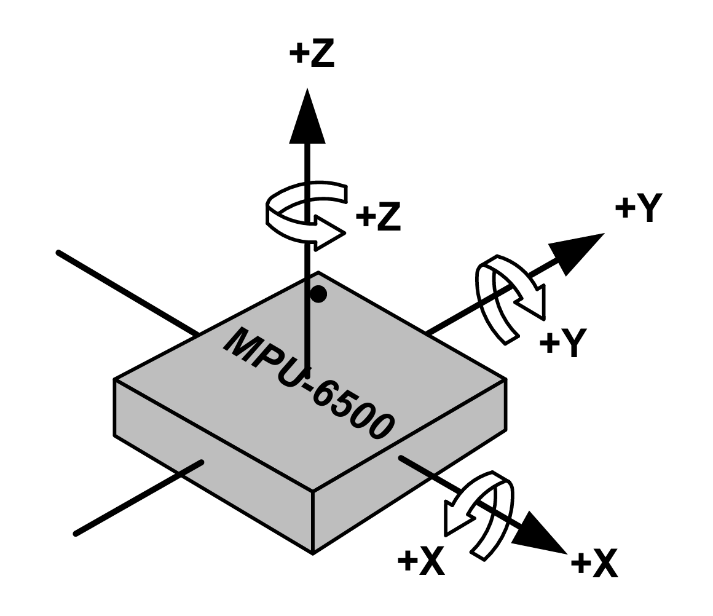
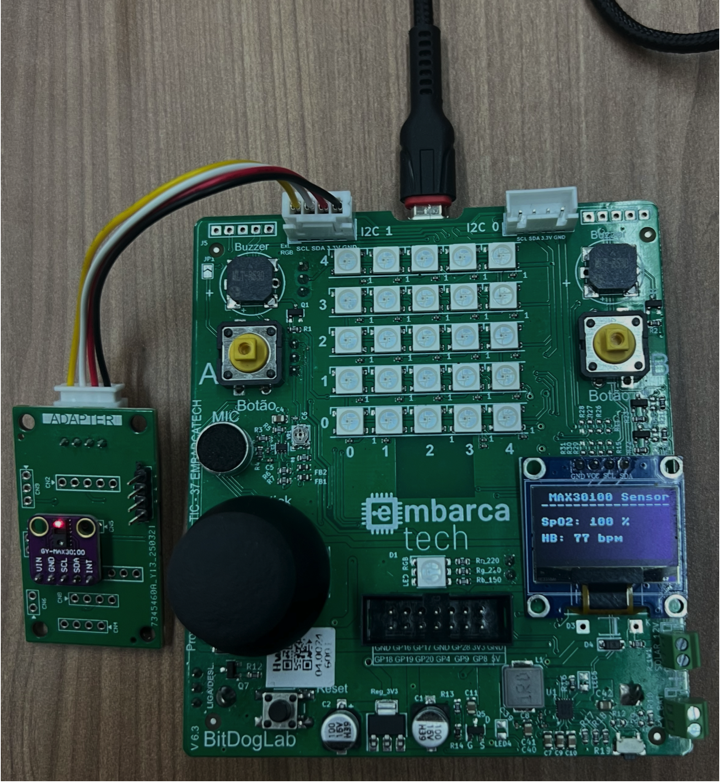
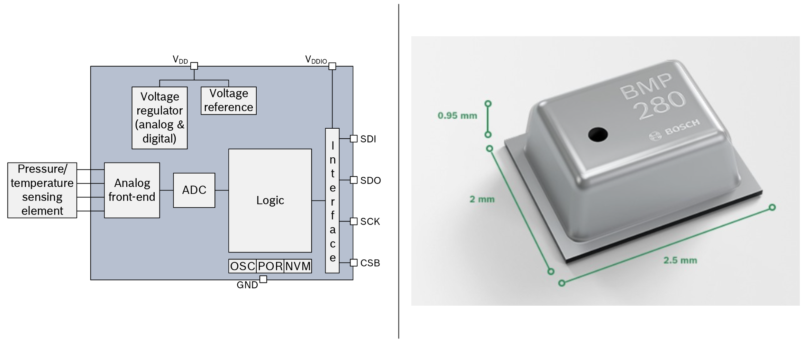
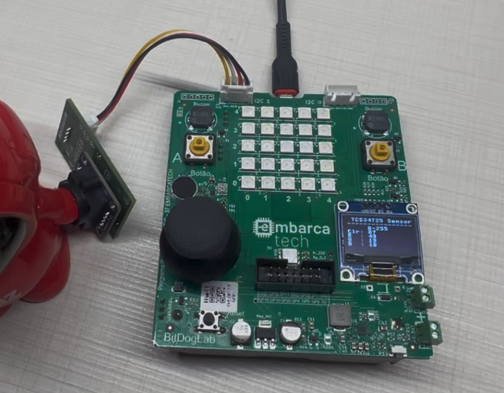

# Hardware Periféricos

Essa pasta apresenta detalhes sobre todos os periféricos desenvolvidos para segunda fase do programa [Embarcatech](https://embarcatech.softex.br/), Os periféricos são compostos pelos seguintes componentes:

* Kit Básico de Periféricos (12 itens)
  * Periferico adaptador de sensores/atuadores
      * [Sensor i2c] Acelerômetro
      * [Sensor i2c] Oxímetro e batimentos cardiácos
      * [Sensor i2c] Medição de distância a Laser
      * [Sensor i2c] Temperatura e pressão
      * [Sensor i2c] Luminosidade
      * [Sensor i2c] Umidade e temperatura
      * [Sensor i2c] Cor RGB
      * [Atuador PWM] Servo Motor
  * Periférico HDMI
  * Periférico de extensão de conexões para sensores (i2c)
  * Periférico teclado matricial (GPIO)
  * Periférico de armazenamento de dados SDCARD (SPI)

* Kit Avançado de Periféricos (19 itens) = Kit Básico (12) + itens abaixo (7)
  * Periférico de extensão de conexões (SPI)
  * Periferico conversor analógico digital ADC / digital analógico DAC / GPIO com oito portas (SPI)
  * Periférico câmera de 2M Pixels (interface paralela)
  * Periférico display LCD 320x240 pixels (SPI)
  * Periférico comunicação radio de longa distância LoRA (SPI)
  * Periférico GPS (UART)
  * Periférico Pi Pico debug probe (SWD)

## Sensor: Acelerômetro (i2c)

O acelerômetro [MPU-6500](https://invensense.tdk.com/products/motion-tracking/6-axis/mpu-6500/) da empresa TDK InvenSense, é a segunda geração do dispositivo de rastreio de movimento (*MotionTracking*) para smartphones, tablets, sensores vestíveis e outros mercados de consumo. O chip MPU-6500 integra um acelerômetro de 3-eixos, um giroscópio de 3-eixos (com 16-bit ADC e condicionamento de sinal cada) e um processador de movimento digital. É o primeiro sensor do mundo a operar em 1,8V consumindo 6,1mW em modo completo de operação. O chip incorpora um giroscópio com performance de apenas +/-5 dps *zero-rate-output* e 0,01 dps/sqrt(Hz) de ruído, com especificação de acelerômetro com offset de +/- 60mg, 300ug/sqrt(Hz) de ruído, e 18uA de corrente de consumo no modo de baixo consumo (*low-power*).

Figura 1: Orientação dos eixos de sensibilidade e polaridade de rotação do MPU-6500.

Pode-se comunicar com o sensor via barramento SPI ou I2C, neste placa adaptadora optamos por comunicar por barramento I2C.

Figura 2: Vista superior da placa de adaptação com o acelerômetro MPU6500 (em cinza) soldado no conector CN1.

Figura 3: Vista inferior da placa de adaptação com o conector XH 2.54mm com 4 pinos do lado esquerdo da imagem.

Seguem os códigos exemplos em [**micropython**](https://github.com/jrfo-hwit/hlab/tree/main/firmware/micropython/examples) &| [**c/c++**](https://github.com/jrfo-hwit/hlab/tree/main/firmware/c_cpp/examples).

Figura 4: Setup de teste do acelerômetro MPU6500.

## Sensor: Oxímetro e batimentos cardíacos (i2c)

O sensor de batimentos cardíacos e oxímetro [MAX30100](https://www.analog.com/en/products/max30100.html) da empresa Analog Devices (Antiga Max Linear), é uma solução completa para sensoriamento integrado de batimentos cardíacos e oxímetro de pulso. A solução combina dois LEDs, um foto-detector, óptica otimizada, e eletrônica de processamento analógica de baixo ruído para detectar sinais de oximetria de pulso e batimentos cardíacos.

Figura 5: Diagrama de blocos sistêmico do MAX30100.

comunica-se com o sensor via barramento I2C na placa adaptadora.

Figura 6: Vista superior da placa de adaptação com o sensor de oxímetro de pulsos e batimentos cardíacos MAX30100 (em cinza) soldado no conector CN1.

Seguem os códigos exemplos em [**micropython**](https://github.com/jrfo-hwit/hlab/tree/main/firmware/micropython/examples) &| [**c/c++**](https://github.com/jrfo-hwit/hlab/tree/main/firmware/c_cpp/examples).

Figura 7: Setup de teste do MAX30100.

## Sensor: Medição de distância a Laser (i2c)

O [VL53L0X](https://www.st.com/en/imaging-and-photonics-solutions/vl53l0x.html) é um sensor de distância compacto da STMicroelectronics que utiliza tecnologia Time-of-Flight (ToF) baseada em um laser VCSEL (Vertical-Cavity Surface-Emitting Laser) para medir com precisão a distância entre o sensor e um objeto, independentemente da refletividade da superfície. Ele mede distâncias de até aproximadamente 2 metros com resolução de 1 mm e boa estabilidade. Seu tempo de resposta é rápido, podendo operar com taxas de até 50 Hz. O VL53L0X comunica-se via barramento I²C (endereçável via software). O princípio de funcionamento consiste na emissão de pulsos de luz infravermelha e na medição precisa do tempo que esses pulsos levam para refletir de volta ao sensor — o que permite calcular a distância absoluta, ao contrário de sensores que apenas estimam por intensidade de luz refletida. É ideal para aplicações como detecção de presença, mapeamento 3D, robótica e automação.

Figura 8: Diagrama de blocos sistêmico do VL53L0X.

Figura 9: Vista superior da placa de adaptação com o sensor ToF VL53L0X (em cinza) soldado no conector CN1.

Seguem os códigos exemplos em [**micropython**](https://github.com/jrfo-hwit/hlab/tree/main/firmware/micropython/examples) &| [**c/c++**](https://github.com/jrfo-hwit/hlab/tree/main/firmware/c_cpp/examples).

Figura 10: Setup de teste do VL53L0X.

## Sensor: Temperatura e pressão (i2c)

O [BMP280](https://www.bosch-sensortec.com/products/environmental-sensors/pressure-sensors/bmp280/) é um sensor barométrico digital de alta precisão desenvolvido pela Bosch Sensortec, projetado para medir pressão atmosférica e temperatura, sendo amplamente utilizado em aplicações como altímetros, estações meteorológicas e dispositivos móveis. Ele oferece medições de pressão com resolução de até 0,16 Pa e precisão típica de ±1 hPa, podendo calcular altitude com precisão de aproximadamente ±1 metro. Mede temperatura com precisão de ±1°C. O sensor suporta comunicação via barramentos I²C e SPI (no nosso caso utilizamos o barramento I²C). Seu princípio de funcionamento baseia-se em um elemento sensor MEMS que detecta variações na pressão atmosférica, permitindo a derivação da altitude ou mudanças meteorológicas com base na variação da pressão do ar. Compacto e de baixo consumo, o BMP280 é ideal para aplicações embarcadas em que tamanho, eficiência energética e confiabilidade são fatores críticos.

Figura 11: Diagrama de blocos sistêmico do BMP280.

Figura 12: Vista superior da placa de adaptação com o sensor BMP280 (em cinza) soldado no conector CN1.

Seguem os códigos exemplos em [**micropython**](https://github.com/jrfo-hwit/hlab/tree/main/firmware/micropython/examples) &| [**c/c++**](https://github.com/jrfo-hwit/hlab/tree/main/firmware/c_cpp/examples).

Figura 13: Setup de teste do BMP280.

## Sensor: Luminosidade (i2c)

​O [BH1750](https://br.mouser.com/ProductDetail/ROHM-Semiconductor/BH1750FVI-TR?qs=phc6PQ%252BTPUNy88lRCs6mVA%3D%3D), desenvolvido pela Rohm Semiconductor, é um sensor digital de luz ambiente que mede a intensidade luminosa em unidades de lux, oferecendo uma faixa de medição de 1 a 65.535 lx com precisão aproximada de ±20%. Utiliza comunicação via barramento I²C. Seu princípio de funcionamento baseia-se em um fotodiodo que converte a luz incidente em corrente elétrica proporcional à intensidade luminosa; essa corrente é então amplificada e convertida em sinal digital por um conversor analógico-digital (ADC) interno. O sensor opera com tensão de alimentação entre 2,4 V e 3,6 V e possui modos de medição com diferentes resoluções e tempos de resposta, como o modo de alta resolução (1 lx) com tempo de medição de 120 ms e o modo de baixa resolução (4 lx) com tempo de 16 ms. Devido à sua alta sensibilidade e resposta espectral semelhante à do olho humano, o BH1750 é amplamente utilizado em aplicações como ajuste automático de brilho de telas, controle de iluminação em automóveis e sistemas de iluminação pública inteligente. ​

Figura 14: Exemplo de aplicação do BH1750.

Figura 15: Vista superior da placa de adaptação com o sensor BH1750 (em cinza) soldado no conector CN1.

Seguem os códigos exemplos em [**micropython**](https://github.com/jrfo-hwit/hlab/tree/main/firmware/micropython/examples) &| [**c/c++**](https://github.com/jrfo-hwit/hlab/tree/main/firmware/c_cpp/examples).

Figura 16: Setup de teste do BH1750.

## Sensor: Umidade e temperatura (i2c)

O [AHT10](https://www.edn.com/temperature-sensor/), desenvolvido pela Asair, é um sensor digital compacto que mede simultaneamente temperatura e umidade relativa com alta precisão e baixo consumo de energia. Utilizando tecnologia CMOSens, ele integra um sensor capacitivo para umidade e um termistor para temperatura em um único encapsulamento SMD de 4×5 mm, ideal para aplicações embarcadas e dispositivos portáteis. O AHT10 comunica-se via interface I²C padrão. Seu princípio de funcionamento baseia-se na detecção de variações capacitivas causadas pela umidade no ambiente e na variação de resistência do termistor com a temperatura. Um ASIC interno processa os sinais analógicos, aplicando compensações e calibrações de fábrica para fornecer dados digitais precisos, eliminando a necessidade de calibração adicional pelo usuário.

Figura 17: Diagrama de blocos sistêmico do AHT10.

Figura 18: Vista superior da placa de adaptação com o sensor AHT10 (em cinza) soldado no conector CN1.

Seguem os códigos exemplos em [**micropython**](https://github.com/jrfo-hwit/hlab/tree/main/firmware/micropython/examples) &| [**c/c++**](https://github.com/jrfo-hwit/hlab/tree/main/firmware/c_cpp/examples).

Figura 19: Setup de teste do AHT10.

## Sensor: Cor RGB (i2c)

O [TCS34725](https://ams-osram.com/products/sensor-solutions/ambient-light-color-spectral-proximity-sensors/ams-tcs34725-color-sensor), desenvolvido pela ams OSRAM, é um sensor de cor digital que mede a intensidade das componentes vermelho, verde, azul (RGB) e clara (sem filtro) da luz ambiente, convertendo-as em sinais digitais de 16 bits por meio de conversores analógico-digitais internos. Equipado com um filtro de bloqueio de infravermelho (IR) integrado, o sensor minimiza a interferência da luz IR, permitindo medições precisas de cor mesmo sob diferentes condições de iluminação. Opera com uma tensão de alimentação entre 2,7 V e 3,6 V e comunica-se via interface I²C. O princípio de funcionamento baseia-se na detecção da luz incidente por fotodiodos específicos para cada componente de cor, cuja intensidade é convertida em sinais digitais proporcionais. Com um alcance dinâmico de 3,8 milhões para 1, o TCS34725 é ideal para aplicações como ajuste automático de brilho de telas, detecção de cor em processos industriais e controle de iluminação inteligente.

Figura 20: Diagrama de blocos sistêmico do TCS34725.

Figura 21: Vista superior da placa de adaptação com o sensor TCS34725 (em cinza) soldado no conector CN1.

Seguem os códigos exemplos em [**micropython**](https://github.com/jrfo-hwit/hlab/tree/main/firmware/micropython/examples) &| [**c/c++**](https://github.com/jrfo-hwit/hlab/tree/main/firmware/c_cpp/examples).

Figura 22: Setup de teste do TCS34725.

## Atuador: Servo Motor (PWM)

## Periférico: HDMI

## Periférico de extensão de conexões para sensores (i2c)

## Periférico teclado matricial (GPIO)

## Periférico de armazenamento de dados SDCARD (SPI)

## Periférico de extensão de conexões (SPI)

## Periferico ADC / DAC / GPIO com oito portas (SPI)

## Periférico câmera de 2M Pixels (interface paralela)

## Periférico display LCD 320x240 pixels (SPI)

## Periférico comunicação radio de longa distância LoRA (SPI)

## Periférico GPS (UART)

## Periférico Pi Pico debug probe (SWD)

# [Hardware Innovation Technologies](http://www.hwit.com.br/)
