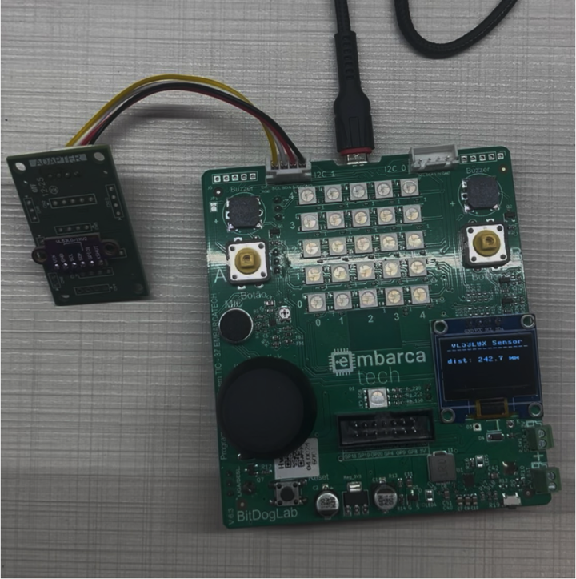
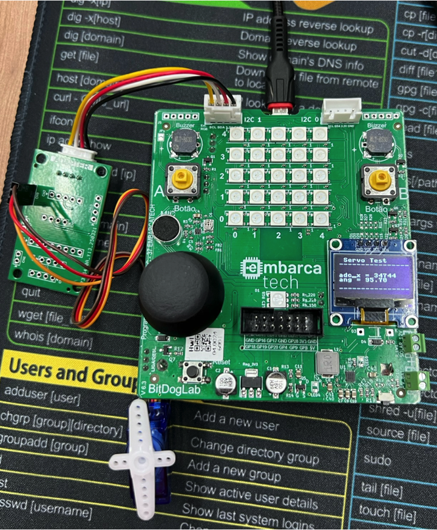
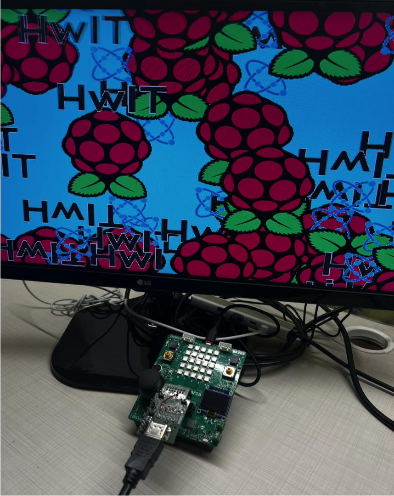
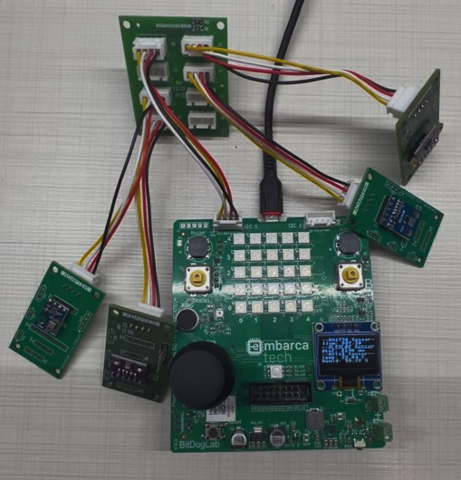

# Hardware Periféricos

Essa pasta apresenta detalhes sobre todos os periféricos desenvolvidos para segunda fase do programa [Embarcatech](https://embarcatech.softex.br/), Os periférics são compostos pelos seguintes componentes:

* Kit Básico de Periféricos (12 itens)
  * Periferico adaptador de sensores/atuadores
      * [[Sensor i2c] Acelerômetro](#sensor-aceler%C3%B4metro-i2c)
      * [[Sensor i2c] Oxímetro e batimentos cardiácos](#sensor-ox%C3%ADmetro-e-batimentos-card%C3%ADacos-i2c)
      * [[Sensor i2c] Medição de distância a Laser](#sensor-medi%C3%A7%C3%A3o-de-dist%C3%A2ncia-a-laser-i2c)
      * [[Sensor i2c] Temperatura e pressão](#sensor-temperatura-e-press%C3%A3o-i2c)
      * [[Sensor i2c] Luminosidade](#sensor-luminosidade-i2c)
      * [[Sensor i2c] Umidade e temperatura](#sensor-umidade-e-temperatura-i2c)
      * [[Sensor i2c] Cor RGB](#sensor-cor-rgb-i2c)
      * [[Atuador PWM] Servo Motor](#atuador-servo-motor-pwm)
  * [Periférico HDMI-DVI](#perif%C3%A9rico-hdmi)
  * [Periférico de extensão de conexões para sensores (i2c)](#perif%C3%A9rico-de-extens%C3%A3o-de-conex%C3%B5es-para-sensores-i2c)
  * [Periférico teclado matricial (GPIO)](#perif%C3%A9rico-teclado-matricial-gpio)
  * [Periférico de armazenamento de dados SDCARD (SPI)](#perif%C3%A9rico-de-armazenamento-de-dados-sdcard-spi)

* Kit Avançado de Periféricos (19 itens) = Kit Básico (12) + itens abaixo (7)
  * [[Periférico de extensão de conexões (SPI)]](#perif%C3%A9rico-de-extens%C3%A3o-de-conex%C3%B5es-spi)
  * [Periferico conversor analógico digital ADC / digital analógico DAC / GPIO com oito portas (SPI)](#periferico-adc--dac--gpio-com-oito-portas-spi)
  * [Periférico câmera de 2M Pixels (interface paralela)](#perif%C3%A9rico-c%C3%A2mera-de-2m-pixels-interface-paralela)
  * [Periférico display LCD 320x240 pixels (SPI)](#perif%C3%A9rico-display-lcd-320x240-pixels-spi)
  * [Periférico comunicação radio de longa distância LoRA (SPI)](#perif%C3%A9rico-comunica%C3%A7%C3%A3o-radio-de-longa-dist%C3%A2ncia-lora-spi)
  * [Periférico GPS (UART)](#perif%C3%A9rico-gps-uart)
  * [Periférico Pi Pico debug probe (SWD)](#perif%C3%A9rico-pi-pico-debug-probe-swd)

## Sensor: Acelerômetro (i2c)

O acelerômetro [MPU-6500](https://invensense.tdk.com/products/motion-tracking/6-axis/mpu-6500/) da empresa TDK InvenSense, é a segunda geração do dispositivo de rastreio de movimento (*MotionTracking*) para smartphones, tablets, sensores vestíveis e outros mercados de consumo. O chip MPU-6500 integra um acelerômetro de 3-eixos, um giroscópio de 3-eixos (com 16-bit ADC e condicionamento de sinal cada) e um processador de movimento digital. É o primeiro sensor do mundo a operar em 1,8V consumindo 6,1mW em modo completo de operação. O chip incorpora um giroscópio com performance de apenas +/-5 dps *zero-rate-output* e 0,01 dps/sqrt(Hz) de ruído, com especificação de acelerômetro com offset de +/- 60mg, 300ug/sqrt(Hz) de ruído, e 18uA de corrente de consumo no modo de baixo consumo (*low-power*).

Figura 1: Orientação dos eixos de sensibilidade e polaridade de rotação do MPU-6500.

Pode-se comunicar com o sensor via barramento SPI ou I2C, neste placa adaptadora optamos por comunicar por barramento I2C.

Figura 2: Vista superior da placa de adaptação com o acelerômetro MPU6500 (em cinza) soldado no conector CN1.

Figura 3: Vista inferior da placa de adaptação com o conector XH 2.54mm com 4 pinos do lado esquerdo da imagem.

Seguem os códigos exemplos em [**micropython**](https://github.com/jrfo-hwit/hlab/tree/main/firmware/micropython/examples) &| [**c/c++**](https://github.com/jrfo-hwit/hlab/tree/main/firmware/c_cpp/examples).

Figura 4: Setup de teste do acelerômetro MPU6500.

## Sensor: Oxímetro e batimentos cardíacos (i2c)

O sensor de batimentos cardíacos e oxímetro [MAX30100](https://www.analog.com/en/products/max30100.html) da empresa Analog Devices (Antiga Max Linear), é uma solução completa para sensoriamento integrado de batimentos cardíacos e oxímetro de pulso. A solução combina dois LEDs, um foto-detector, óptica otimizada, e eletrônica de processamento analógica de baixo ruído para detectar sinais de oximetria de pulso e batimentos cardíacos.

Figura 5: Diagrama de blocos sistêmico do MAX30100.

comunica-se com o sensor via barramento I2C na placa adaptadora.

Figura 6: Vista superior da placa de adaptação com o sensor de oxímetro de pulsos e batimentos cardíacos MAX30100 (em cinza) soldado no conector CN1.

Seguem os códigos exemplos em [**micropython**](https://github.com/jrfo-hwit/hlab/tree/main/firmware/micropython/examples) &| [**c/c++**](https://github.com/jrfo-hwit/hlab/tree/main/firmware/c_cpp/examples).

Figura 7: Setup de teste do MAX30100.

## Sensor: Medição de distância a Laser (i2c)

O [VL53L0X](https://www.st.com/en/imaging-and-photonics-solutions/vl53l0x.html) é um sensor de distância compacto da STMicroelectronics que utiliza tecnologia Time-of-Flight (ToF) baseada em um laser VCSEL (Vertical-Cavity Surface-Emitting Laser) para medir com precisão a distância entre o sensor e um objeto, independentemente da refletividade da superfície. Ele mede distâncias de até aproximadamente 2 metros com resolução de 1 mm e boa estabilidade. Seu tempo de resposta é rápido, podendo operar com taxas de até 50 Hz. O VL53L0X comunica-se via barramento I²C (endereçável via software). O princípio de funcionamento consiste na emissão de pulsos de luz infravermelha e na medição precisa do tempo que esses pulsos levam para refletir de volta ao sensor — o que permite calcular a distância absoluta, ao contrário de sensores que apenas estimam por intensidade de luz refletida. É ideal para aplicações como detecção de presença, mapeamento 3D, robótica e automação.

Figura 8: Diagrama de blocos sistêmico do VL53L0X.

Figura 9: Vista superior da placa de adaptação com o sensor ToF VL53L0X (em cinza) soldado no conector CN1.

Seguem os códigos exemplos em [**micropython**](https://github.com/jrfo-hwit/hlab/tree/main/firmware/micropython/examples) &| [**c/c++**](https://github.com/jrfo-hwit/hlab/tree/main/firmware/c_cpp/examples).

Figura 10: Setup de teste do VL53L0X.

## Sensor: Temperatura e pressão (i2c)

O [BMP280](https://www.bosch-sensortec.com/products/environmental-sensors/pressure-sensors/bmp280/) é um sensor barométrico digital de alta precisão desenvolvido pela Bosch Sensortec, projetado para medir pressão atmosférica e temperatura, sendo amplamente utilizado em aplicações como altímetros, estações meteorológicas e dispositivos móveis. Ele oferece medições de pressão com resolução de até 0,16 Pa e precisão típica de ±1 hPa, podendo calcular altitude com precisão de aproximadamente ±1 metro. Mede temperatura com precisão de ±1°C. O sensor suporta comunicação via barramentos I²C e SPI (no nosso caso utilizamos o barramento I²C). Seu princípio de funcionamento baseia-se em um elemento sensor MEMS que detecta variações na pressão atmosférica, permitindo a derivação da altitude ou mudanças meteorológicas com base na variação da pressão do ar. Compacto e de baixo consumo, o BMP280 é ideal para aplicações embarcadas em que tamanho, eficiência energética e confiabilidade são fatores críticos.

Figura 11: Diagrama de blocos sistêmico do BMP280.

Figura 12: Vista superior da placa de adaptação com o sensor BMP280 (em cinza) soldado no conector CN1.

Seguem os códigos exemplos em [**micropython**](https://github.com/jrfo-hwit/hlab/tree/main/firmware/micropython/examples) &| [**c/c++**](https://github.com/jrfo-hwit/hlab/tree/main/firmware/c_cpp/examples).

Figura 13: Setup de teste do BMP280.

## Sensor: Luminosidade (i2c)

​O [BH1750](https://br.mouser.com/ProductDetail/ROHM-Semiconductor/BH1750FVI-TR?qs=phc6PQ%252BTPUNy88lRCs6mVA%3D%3D), desenvolvido pela Rohm Semiconductor, é um sensor digital de luz ambiente que mede a intensidade luminosa em unidades de lux, oferecendo uma faixa de medição de 1 a 65.535 lx com precisão aproximada de ±20%. Utiliza comunicação via barramento I²C. Seu princípio de funcionamento baseia-se em um fotodiodo que converte a luz incidente em corrente elétrica proporcional à intensidade luminosa; essa corrente é então amplificada e convertida em sinal digital por um conversor analógico-digital (ADC) interno. O sensor opera com tensão de alimentação entre 2,4 V e 3,6 V e possui modos de medição com diferentes resoluções e tempos de resposta, como o modo de alta resolução (1 lx) com tempo de medição de 120 ms e o modo de baixa resolução (4 lx) com tempo de 16 ms. Devido à sua alta sensibilidade e resposta espectral semelhante à do olho humano, o BH1750 é amplamente utilizado em aplicações como ajuste automático de brilho de telas, controle de iluminação em automóveis e sistemas de iluminação pública inteligente. ​

Figura 14: Exemplo de aplicação do BH1750.

Figura 15: Vista superior da placa de adaptação com o sensor BH1750 (em cinza) soldado no conector CN1.

Seguem os códigos exemplos em [**micropython**](https://github.com/jrfo-hwit/hlab/tree/main/firmware/micropython/examples) &| [**c/c++**](https://github.com/jrfo-hwit/hlab/tree/main/firmware/c_cpp/examples).

Figura 16: Setup de teste do BH1750.

## Sensor: Umidade e temperatura (i2c)

O [AHT10](https://www.edn.com/temperature-sensor/), desenvolvido pela Asair, é um sensor digital compacto que mede simultaneamente temperatura e umidade relativa com alta precisão e baixo consumo de energia. Utilizando tecnologia CMOSens, ele integra um sensor capacitivo para umidade e um termistor para temperatura em um único encapsulamento SMD de 4×5 mm, ideal para aplicações embarcadas e dispositivos portáteis. O AHT10 comunica-se via interface I²C padrão. Seu princípio de funcionamento baseia-se na detecção de variações capacitivas causadas pela umidade no ambiente e na variação de resistência do termistor com a temperatura. Um ASIC interno processa os sinais analógicos, aplicando compensações e calibrações de fábrica para fornecer dados digitais precisos, eliminando a necessidade de calibração adicional pelo usuário.

Figura 17: Diagrama de blocos sistêmico do AHT10.

Figura 18: Vista superior da placa de adaptação com o sensor AHT10 (em cinza) soldado no conector CN1.

Seguem os códigos exemplos em [**micropython**](https://github.com/jrfo-hwit/hlab/tree/main/firmware/micropython/examples) &| [**c/c++**](https://github.com/jrfo-hwit/hlab/tree/main/firmware/c_cpp/examples).

Figura 19: Setup de teste do AHT10.

## Sensor: Cor RGB (i2c)

O [TCS34725](https://ams-osram.com/products/sensor-solutions/ambient-light-color-spectral-proximity-sensors/ams-tcs34725-color-sensor), desenvolvido pela ams OSRAM, é um sensor de cor digital que mede a intensidade das componentes vermelho, verde, azul (RGB) e clara (sem filtro) da luz ambiente, convertendo-as em sinais digitais de 16 bits por meio de conversores analógico-digitais internos. Equipado com um filtro de bloqueio de infravermelho (IR) integrado, o sensor minimiza a interferência da luz IR, permitindo medições precisas de cor mesmo sob diferentes condições de iluminação. Opera com uma tensão de alimentação entre 2,7 V e 3,6 V e comunica-se via interface I²C. O princípio de funcionamento baseia-se na detecção da luz incidente por fotodiodos específicos para cada componente de cor, cuja intensidade é convertida em sinais digitais proporcionais. Com um alcance dinâmico de 3,8 milhões para 1, o TCS34725 é ideal para aplicações como ajuste automático de brilho de telas, detecção de cor em processos industriais e controle de iluminação inteligente.

Figura 20: Diagrama de blocos sistêmico do TCS34725.

Figura 21: Vista superior da placa de adaptação com o sensor TCS34725 (em cinza) soldado no conector CN1.

Seguem os códigos exemplos em [**micropython**](https://github.com/jrfo-hwit/hlab/tree/main/firmware/micropython/examples) &| [**c/c++**](https://github.com/jrfo-hwit/hlab/tree/main/firmware/c_cpp/examples).

Figura 22: Setup de teste do TCS34725.

## Atuador: Servo Motor (PWM)

O [SG90 9g](https://github.com/jrfo-hwit/hlab/tree/main/hardware/peripherals_hw/docs/SG90_datasheet.pdf) é um micro servo motor analógico amplamente utilizado em aplicações de modelismo, robótica e projetos educacionais devido à sua leveza, baixo custo e facilidade de controle. Fabricado pela Tower Pro, possui dimensões compactas de aproximadamente 23 × 12,2 × 29 mm e pesa cerca de 9 gramas. Opera com tensão de alimentação entre 3,0 V e 6,0 V, oferecendo torque de até 1,8 kg·cm a 4,8 V e velocidade de 0,1 s/60° sob essa tensão . Seu controle é realizado por meio de sinal PWM (modulação por largura de pulso), utilizando uma interface de três fios: sinal, alimentação positiva e terra. O princípio de funcionamento baseia-se na comparação entre o sinal de controle e a posição atual do eixo, ajustando a posição por meio de um sistema de feedback que utiliza um potenciômetro interno. Devido à sua construção simples e confiável, o SG90 é ideal para aplicações que requerem movimentos angulares precisos, como braços robóticos, mecanismos de pan/tilt e sistemas de controle de superfícies móveis.​

:warning: É importante entender que existem dois tipos de servo motores SG90, o posicional que controla por meio do PWM a posição angular do motor, e o continuo que por meio da mesma interface controla a velocidade e direção da rotação contínua do eixo do motor.

Figura 23: Diagrama de blocos do Servo SG90.

Figura 24: Vista superior da placa de adaptação para conexão do Servo SG90 no CN9.

Seguem os códigos exemplos em [**micropython**](https://github.com/jrfo-hwit/hlab/tree/main/firmware/micropython/examples) &| [**c/c++**](https://github.com/jrfo-hwit/hlab/tree/main/firmware/c_cpp/examples).

Figura 25: Setup de teste do Servo SG90.

## Periférico: HDMI-DVI

A interface de video/audio [HDMI](https://pt.wikipedia.org/wiki/High-Definition_Multimedia_Interface) (High-Definition Multimedia Interface) ou somente vídeo [DVI](https://pt.wikipedia.org/wiki/Digital_Visual_Interface) (Digital Visual Interface) é um padrão de conexão criado para transmitir sinais de vídeo de alta qualidade entre uma fonte digital (como uma placa de vídeo) e um dispositivo de exibição (como um monitor LCD ou projetor). Desenvolvida pela Digital Display Working Group (DDWG), a DVI suporta transmissões digitais (DVI-D), analógicas (DVI-A) ou ambas (DVI-I), permitindo compatibilidade com tecnologias anteriores como VGA. Opera com largura de banda suficiente para resoluções de até 1920×1200 a 60 Hz em modo single-link, ou até 2560×1600 em modo dual-link (no caso do uso com a Pi Pico IO 2040, atinge no máximo resolução HD de 128x720 @ 30Hz). 

A comunicação ocorre por meio de sinais diferenciais (TMDS – Transition Minimized Differential Signaling), que minimizam interferências e perdas, transmitindo dados de pixel sincronizados com sinais de clock (comunicação realizada diretamente pelos GPIOs da Pi Pico 2040 por meio do Programmable Input Output - PIO). Seu princípio de funcionamento baseia-se na conversão digital direta da imagem, eliminando conversões analógico-digitais intermediárias, o que garante fidelidade e desempenho superiores em relação a interfaces puramente analógicas. DVI ainda é amplamente utilizado, embora esteja sendo gradualmente substituído por HDMI e DisplayPort em aplicações modernas.

Figura 26: Diagrama de blocos da interface elétrica do video HDMI e DVI.

Figura 27: Vista superior da placa periférica de video HDMI e DVI.

Seguem os códigos exemplos em [**c/c++**](https://github.com/jrfo-hwit/hlab/tree/main/firmware/c_cpp/examples).

Figura 28: Setup de teste do video HDMI e DVI.

## Periférico de extensão de conexões para sensores (i2c)

Uma placa de extensão I²C com 8 portas (uma porta especifica para a placa mestre e 7 conexões de expansão de I²Cs) e conectores XH 2.54mm de 4 pinos é um módulo projetado para facilitar a conexão de múltiplos dispositivos I²C a um único barramento mestre, organizando fisicamente o cabeamento e permitindo expansões limpas e seguras em projetos embarcados. Cada uma das 8 portas fornece os sinais padrão do barramento I²C — SDA (dados), SCL (clock), VCC e GND — em conectores XH de 4 pinos com passo de 2,54 mm, comuns em aplicações de robótica e automação. 

A placa em si atua como um hub passivo (sem componentes ativos ou circuitos de multiplexação), replicando os sinais do barramento principal para todas as portas disponíveis. Seu princípio de funcionamento baseia-se na topologia de conexão paralela típica do protocolo I²C, onde todos os dispositivos compartilham os mesmos sinais, com identificação feita por endereços únicos atribuídos a cada escravo. Essa placa é ideal para prototipagem modular com sensores, atuadores e periféricos que usem o protocolo I²C, permitindo conexões firmes, padronizadas e organizadas.

Figura 29: Vista superior da placa periférica de extensão de dispositivos I²C.

Seguem os códigos exemplos em [**micropython**](https://github.com/jrfo-hwit/hlab/tree/main/firmware/micropython/examples) &| [**c/c++**](https://github.com/jrfo-hwit/hlab/tree/main/firmware/c_cpp/examples).

Figura 30: Setup de teste da placa periferica de extensão de dispositivos I²C com 4 sensores conectados.

## Periférico teclado matricial (GPIO)

O periférico de conexão do teclado matricial adapta a conexão no conector IDC da placa mestre um teclado 4x4, que é um dispositivo de entrada composto por 16 teclas organizadas em uma matriz de 4 linhas por 4 colunas, comumente utilizado em sistemas embarcados para entrada de dados como senhas, comandos ou menus. Ele possui 8 pinos de conexão (4 para linhas e 4 para colunas), que podem são conectados nos 8 GPIOs disponíveis no conector IDC (excluindo o GPIO28). 

O princípio de funcionamento baseia-se na varredura sequencial: o microcontrolador configura uma linha por vez em nível lógico baixo e lê o estado das colunas — se houver continuidade elétrica entre uma linha e uma coluna, significa que a tecla correspondente foi pressionada. Essa técnica economiza pinos e permite detectar múltiplas teclas com uma lógica simples. O teclado normalmente é feito de membrana ou plástico rígido, compacto e de baixo custo, ideal para interfaces humanas em dispositivos eletrônicos como painéis de controle, cofres eletrônicos, sistemas de alarme e automação residencial.

Figura 31: Diagrama de conexões da placa de interface IDC com o teclado.

Figura 32: Vista superior da placa periférica de interface com o teclado.

Seguem os códigos exemplos em [**micropython**](https://github.com/jrfo-hwit/hlab/tree/main/firmware/micropython/examples) &| [**c/c++**](https://github.com/jrfo-hwit/hlab/tree/main/firmware/c_cpp/examples).

Figura 33: Setup de teste da placa de interface com o teclado.

## Periférico de armazenamento de dados SDCARD (SPI)

Uma placa adaptadora de SD Card para pinos header é um módulo que permite a conexão fácil de cartões de memória SD ou microSD a microcontroladores ou sistemas embarcados, utilizando pinos tipo header (geralmente em um conector de 6 a 8 vias com passo de 2,54 mm). A principal função dessa placa é adaptar o formato físico e os níveis lógicos do cartão SD (normalmente 3,3 V) ao padrão dos sistemas de prototipagem, que muitas vezes operam com 5 V. A comunicação com o cartão é feita via barramento SPI (Serial Peripheral Interface), utilizando os sinais padrão: MISO, MOSI, SCK e CS, além de VCC e GND. Algumas versões da placa incluem reguladores de tensão e divisores resistivos para compatibilidade de nível lógico. O princípio de funcionamento baseia-se na comunicação serial síncrona, onde o microcontrolador envia comandos e dados ao cartão e recebe respostas sequenciais, permitindo leitura e escrita em blocos de memória. Essa solução é amplamente usada em projetos de data logging, armazenamento de arquivos ou sistemas embarcados que precisam de expansão de memória não volátil.

## Periférico de extensão de conexões (SPI)

Uma placa de extensão de conexões SPI com até 4 linhas de chip select (CS) é um módulo projetado para facilitar a conexão de múltiplos dispositivos SPI a um único barramento mestre, oferecendo quatro canais independentes de seleção de dispositivos. Ela distribui os sinais padrão do barramento SPI — SCK (clock), MOSI (dados do mestre para o escravo), MISO (dados do escravo para o mestre), GND e VCC — para múltiplas saídas, adicionando até quatro linhas dedicadas de chip select (geralmente controladas diretamente pelo microcontrolador). Essa configuração permite que o mestre se comunique com até quatro periféricos SPI distintos, ativando um por vez. O princípio de funcionamento baseia-se na seleção individual dos dispositivos escravos por meio do pino CS correspondente: apenas o dispositivo com CS ativo (nível lógico baixo) responde à comunicação, enquanto os demais permanecem inativos no barramento. Essa placa é ideal para prototipagem e expansão de projetos embarcados com sensores, memórias flash, displays e outros periféricos SPI, garantindo organização e isolamento físico das conexões.

## Periferico ADC / DAC / GPIO com oito portas (SPI)

O AD5592R, desenvolvido pela Analog Devices, é um circuito integrado multifuncional que combina conversores analógico-digital (ADC), digital-analógico (DAC) e entradas/saídas digitais (GPIO) em um único chip, oferecendo flexibilidade e economia de espaço para sistemas embarcados. Ele possui oito pinos de entrada/saída (I/O0 a I/O7) que podem ser configurados individualmente como entradas ADC de 12 bits, saídas DAC de 12 bits, entradas digitais ou saídas digitais. O dispositivo opera com uma tensão de alimentação única de 2,7 V a 5,5 V e incorpora uma referência interna de 2,5 V, permitindo saídas de DAC com alcance de 0 V a VREF ou 0 V a 2×VREF. A comunicação é realizada via interface SPI de alta velocidade, com taxa de conversão do ADC de até 400 kSPS. O princípio de funcionamento baseia-se na configuração dinâmica dos pinos de I/O, permitindo que cada pino atue conforme a necessidade da aplicação, seja como conversor ou como GPIO, facilitando o controle e monitoramento de sinais analógicos e digitais em sistemas integrados.​

## Periférico câmera de 2M Pixels (interface paralela)

A câmera OV2640 é um módulo compacto com sensor CMOS de 2 megapixels (1600×1200) desenvolvido pela OmniVision, amplamente utilizado em sistemas embarcados, robótica e dispositivos IoT devido à sua alta integração e baixo consumo. Ela suporta saída de imagem comprimida JPEG ou em formatos brutos como RGB e YUV, e se comunica com microcontroladores através de uma interface paralela de 8 bits, junto com sinais de sincronismo como VSYNC, HSYNC e PCLK, além de um barramento I²C para configuração dos registradores internos. O princípio de funcionamento baseia-se na captação de luz pelo sensor CMOS, onde cada fotodiodo converte luz em carga elétrica, que é lida sequencialmente e convertida em sinal digital. A interface paralela permite transmitir rapidamente grandes volumes de dados de imagem, ideal para aplicações em tempo real como visão computacional, reconhecimento de objetos e streaming. Compacta e eficiente, a OV2640 também inclui controle automático de exposição, balanço de branco e ganho, o que facilita seu uso em ambientes variados.

## Periférico display LCD 320x240 pixels (SPI)

O display LCD de 2,4 polegadas com resolução de 320x240 pixels e controlador ST7789 é um módulo TFT colorido que utiliza comunicação SPI, sendo ideal para aplicações embarcadas que exigem exibição gráfica com boa definição e baixo consumo de pinos. O controlador ST7789 integra memória gráfica, interface de comunicação e circuitos de controle de varredura, permitindo que o microcontrolador envie comandos e dados gráficos por meio de uma interface SPI de 4 ou 5 fios (com sinais como MOSI, SCK, CS, DC e opcionalmente RESET). O display opera geralmente com alimentação de 3,3 V, tem profundidade de cor de 16 bits (65 mil cores) e atualiza imagens por meio do envio sequencial de dados para cada pixel da matriz, que são controlados por transistores TFT. O princípio de funcionamento baseia-se na manipulação de cristais líquidos por sinais elétricos que controlam a passagem de luz através de filtros RGB, formando as imagens. Compacto, leve e com ótima qualidade visual, é ideal para interfaces gráficas de usuário (GUI) em projetos de automação, wearables, instrumentos portáteis e displays de status.

## Periférico comunicação radio de longa distância LoRA (SPI)

O [RFM95W](https://www.hoperf.com/modules/lora/RFM95W.html) 915 MHz da HopeRF é um módulo transceptor de rádio que utiliza a tecnologia LoRa (Long Range) para comunicações sem fio de longo alcance com baixo consumo de energia, ideal para aplicações em Internet das Coisas (IoT), agricultura de precisão, cidades inteligentes e redes de sensores distribuídas. Ele opera na faixa ISM de 915 MHz (utilizada nas Américas) e é baseado no chip Semtech SX1276, oferecendo alcance de até 15 km em campo aberto, sensibilidade de até -148 dBm e potência de transmissão ajustável até +20 dBm. A comunicação com microcontroladores é realizada via barramento SPI, permitindo controle completo das configurações de rádio, modulação e protocolos. O princípio de funcionamento baseia-se na modulação LoRa, que utiliza chirp spread spectrum (CSS) para espalhar os dados transmitidos em uma faixa mais ampla de frequência, garantindo alta robustez contra interferência e excelente desempenho em ambientes com ruído ou obstáculos. Com suporte a modos de economia de energia e criptografia AES-128, o RFM95W é ideal para aplicações de comunicação ponto a ponto ou em redes LoRaWAN.

## Periférico GPS (UART)

O módulo GY-NEO6MV2 é um receptor GPS baseado no chip NEO-6M da u-blox, amplamente utilizado em projetos de sistemas embarcados, drones e aplicações de geolocalização devido à sua precisão e facilidade de integração. Este módulo opera com tensões de 3,3 V a 5 V e comunica-se com microcontroladores por meio de interface UART (TX/RX) em nível TTL, com taxa de transmissão padrão de 9600 bps . Possui uma antena cerâmica externa conectada via conector U.FL, uma bateria de backup para inicialização rápida (hot start) e memória EEPROM para armazenamento de configurações . Com precisão horizontal de aproximadamente 2,5 metros e suporte a até 50 canais simultâneos, o módulo fornece dados de latitude, longitude, altitude e velocidade por meio de sentenças NMEA . Seu princípio de funcionamento baseia-se na recepção de sinais de satélites GPS, cálculo de tempo e posição, e transmissão dessas informações ao sistema hospedeiro, sendo ideal para aplicações que requerem posicionamento geográfico confiável e de baixo custo.​

## Periférico Pi Pico debug probe (SWD)

O Raspberry Pi Pico Probe customizado é uma ferramenta de depuração baseada no microcontrolador RP2040, desenvolvida pela Raspberry Pi Foundation, adaptada a partir do circuito original do projeto Pico Probe, mas montada sobre uma breakout board personalizada onde o próprio Raspberry Pi Pico é soldado diretamente. Esse dispositivo atua como um adaptador USB para SWD (Serial Wire Debug) e UART, permitindo a programação e depuração de microcontroladores compatíveis, como o próprio RP2040 ou outros chips ARM Cortex-M. A comunicação com o host é feita via USB, enquanto a interface de depuração com o alvo é feita por meio do barramento SWD (SWDIO e SWCLK), além de uma porta UART para monitoramento serial. O princípio de funcionamento baseia-se na utilização do firmware open-source PicoProbe, que transforma o RP2040 em uma sonda CMSIS-DAP e porta serial virtual, permitindo integração com ambientes como OpenOCD e VS Code. Essa versão customizada, ao utilizar uma breakout board, oferece maior robustez mecânica e acessibilidade de conexões, sendo ideal para laboratórios, ensino e desenvolvimento de sistemas embarcados com foco em custo reduzido e facilidade de uso.

# [Hardware Innovation Technologies](http://www.hwit.com.br/)
